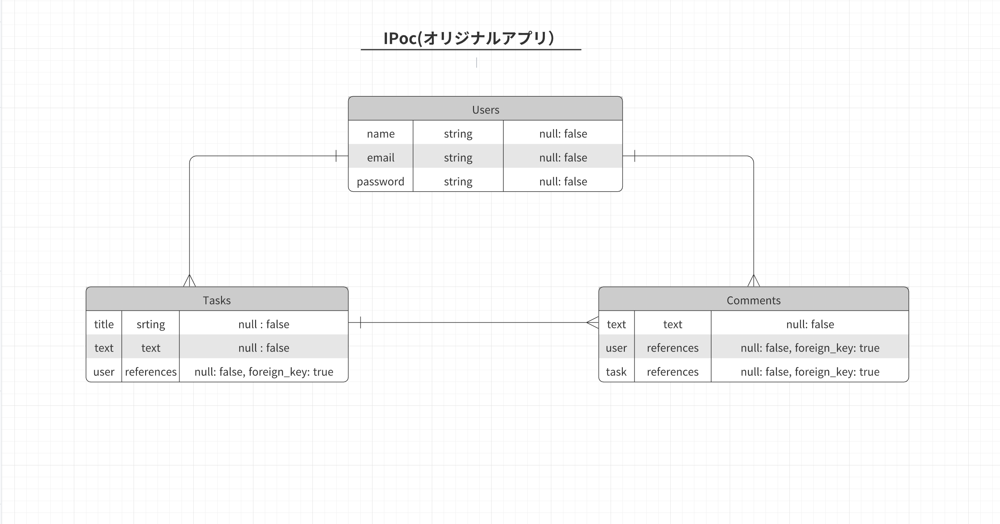

# 💪Ipoc　- it's a piece of cake -

 このアプリは良い習慣を身に付けるためのコミニケーションアプリです。 
 ipocはit's a piece of cakeの頭文字を取っていて、みんなで協力すればいい習慣を身に付けることなんか「楽勝」「朝飯前」という意味を込めています。

## 💪アプリケーション概要

このアプリの目的は良い習慣を身に付けることです。内容は、身につけたい習慣を設定し共有します。 
そして、その目的が達成できているかどうかを投稿します。お互いに習慣を身につけられているかどうかを監視することで緊張感を持たせ達成しやすくしています。 
 
このアプリを作成しようと思った理由は、自分の原体験にあります。自粛期間中に、筋トレを始めようと思いやってみたところすぐに挫折してしまいました。 
ですが、どうしても続けたいと思い考えた結果、筋トレが終わったら人に報告するということを始めました。そうすると、一人で続けた時とは比べ物にならないくらい続けやすく、この体験を皆さんも共有したいと考え作成しました。

## 💪目指した課題解決

作成するにあたり以下のペルソナを設定しました

・性別 → 問わない 
・年齢 →問わない 
・職業 → 問わない 
・趣味 → 特別、熱中できる趣味を持っていない 
・日頃の生活 → 仕事、学校、バイトが終わったらなんの目的もなく動画やスマホに時間を費やしている。現状の生活に不満を抱えている。何か一つのことを達成したいとぼんやり考えている。 

## 💪機能一覧（実装予定も含む）
・ユーザー管理機能 
・CRUD機能 
・コメント機能 

## 💪使用技術

## 💪ER図

# テーブル設計

## Usersテーブル

| Column   | Type   | Option      |
| -------- | ------ | ----------- |
| name     | string | null: false |
| email    | string | null: false |
| password | string | null: false |

### Association

- has_many tasks
- has_many comments

## Tasksテーブル

| Column | Type       | Option                         |
| ------ | ---------- | ------------------------------ |
| title  | string     | null: false                    |
| text   | text       | null: false                    |
| user   | references | null: false, foreign_key, true |

###

- belongs_to user
- has_many comments

## Commentsテーブル

| Column | Type       | Option                         | 
| ------ | ---------- | ------------------------------ |
| text   | text       | null: false                    |
| user   | references | null: false, foreign_key, true |
| task   | references | null: false, foreign_key, true |

- belongs_to user
- belongs_to task

